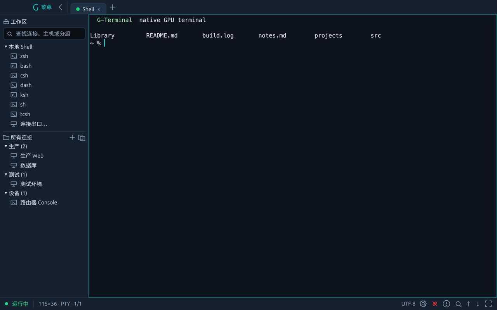
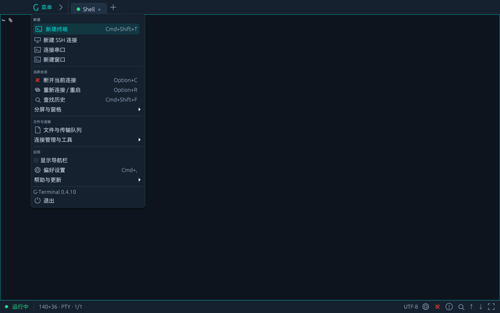
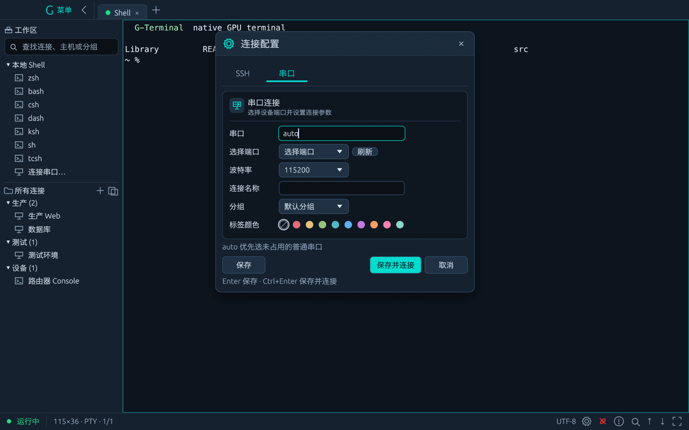
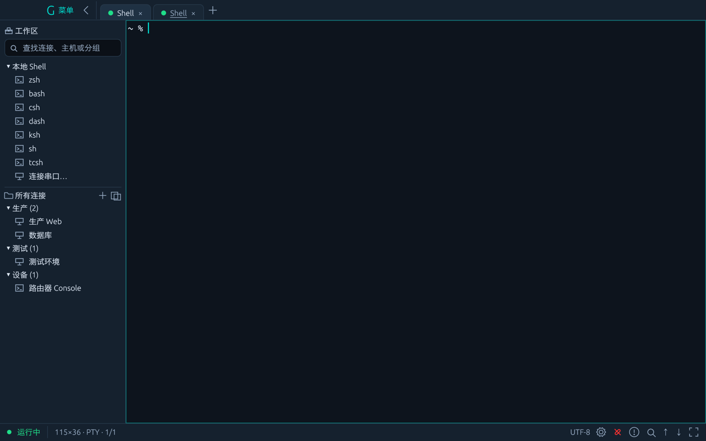

# G-Terminal

原生 GPU 终端，Rust + egui。Windows 默认 Direct3D 11 渲染，其余平台走 wgpu；无 Electron / Chromium / WebView。

当前版本 **0.4.10**。交付 Windows x64 与 macOS arm64 便携版；Linux 入口保留、尚未实机验证。推荐 Windows 11（ConPTY 需 Windows 10 1809+）。

## 截图



本地 Shell 与分组连接；状态栏含历史查找、上下行速率和缩放手柄。



G 菜单按新建、当前会话、文件与连接、应用分区；分屏 / 连接工具 / 帮助更新收在子菜单。



串口连接（端口下拉 / 手填 / `auto`）；被占用时可「占用排查」列出持有进程并结束它。



后台标签有新输出时标签带下划线，切回即消失。

## 功能

**会话与界面**

- 本地 Shell 枚举：Windows 为 PowerShell / PowerShell 7 / CMD / WSL；macOS、Linux 读 `/etc/shells`（加 `$SHELL` 与常见 Homebrew 路径），可选默认项。
- 任意嵌套分屏（每标签 ≤ 32 窗格）；标签页右键：分屏 / 复制会话 / 关闭其它 / 关闭断开；菜单「新建窗口」。
- 连接和分组可配标签颜色，**连接色优先于分组色**；有颜色的会话给标签页铺底色。
- 连接导航：搜索框支持 `user:pass@host[:port]` 快速连接；保存的连接可拖入分组、拖到控制台新建会话；右键复制连接配置或整份列表。
- 标签：后台新输出加下划线、响铃显示铃铛；shell 的 OSC 0/2 标题用于窗口标题。
- 输入：文本框右键菜单（复制 / 剪切 / 粘贴 / 全选）；终端链接 `Cmd/Ctrl+点击` 打开；选中文本浏览器搜索（引擎可切换）；拖放文件上传 SFTP。
- 记住上次标签（按断开状态还原）；串口可设后台自动断开。

**SSH / 文件 / 传输**

- 内置 `russh` / `russh-sftp` / Tokio，不依赖本机 OpenSSH；密码或私钥（含口令）认证；首连指纹写入 `~/.ssh/known_hosts`，密钥变化拒绝连接。
- 单级 ProxyJump 与多条本地转发；连接时先自动试一次免密。
- 启动读取 `~/.ssh/config`，导入带 `HostName` 的 `Host`，列在只读的 SSH-CONFIG 分组。
- 文件窗口：本地 / 远程双表格，目录传输、断点续传、冲突处理；POSIX 权限编辑（本地在 macOS / Linux 亦可）。
- ZMODEM：终端内敲 `rz` / `sz` 或文件窗口显式收发。

**终端能力**

| 能力 | 范围 |
| --- | --- |
| VT / xterm | 光标、擦除、16 / 256 / RGB 色、备用屏、应用光标键、光标查询、括号粘贴；基于 vt100，非完整 xterm |
| 鼠标 | legacy / UTF-8 / SGR；Shift 绕过上报进行选择 |
| 图像 | OSC 1337 内联 PNG（限尺寸与内存，只留最近一张；不支持 Kitty / Sixel） |
| 文字 | 中文宽字符与字体回退；cosmic-text shaping + swash 栅格化；macOS 中文基线已对齐拉丁字体 |
| 输入法 | IME 预编辑 / 提交 / 候选位置；提交时那一次回车不会发给 Shell |
| 无障碍 | AccessKit 提供可见文本标签（未做读屏播报验收） |

## 快捷键

| 快捷键 | 操作 |
| --- | --- |
| Ctrl+Shift+T / W | 新建标签 / 关闭窗格 |
| Ctrl+Shift+D / E | 左右 / 上下分屏 |
| Ctrl+Tab / Alt+Right | 切换标签 / 窗格 |
| Ctrl+Shift+C / V、Ctrl+V、中键 | 复制 / 粘贴 |
| Ctrl+C | Shell 中断 |
| Ctrl+Shift+F | 历史查找 |
| Shift+PageUp / PageDown | 翻阅历史 |
| Ctrl+Plus / Minus / 0 | 字号放大 / 缩小 / 重置 |
| Ctrl+, / Ctrl+Shift+B | 设置 / 侧栏 |

关闭窗格终止对应 Shell；粘贴可能执行换行文本，单次 ≤ 1 MiB。
macOS 上 `Ctrl` 对应 `Cmd`、`Alt` 对应 `Option`；`Ctrl+C` 仍是中断、`Ctrl+Tab` 仍切换标签（`Cmd+Tab` 被系统占用）。

## 构建与运行

需要 Rust ≥ 1.88（验证 1.98.1）。

Windows（MSVC，与发布包一致；或 mingw 工具链）：

```powershell
./scripts/build.ps1 -Action build -Release
./scripts/package.ps1
```

macOS（只需 Command Line Tools 和 rustup，直接用 cargo）：

```sh
cargo run --release
cargo fmt --check && cargo clippy --all-targets -- -D warnings && cargo test
./scripts/package-macos.sh   # 产出 .app 与 tar.gz + SHA256
```

发布包内含第三方许可，旁附 SHA256 校验文件。

## 配置与架构

配置：Windows `%APPDATA%\gterminal\G-Terminal\config\settings.json`，macOS `~/Library/Application Support/dev.gterminal.G-Terminal/settings.json`（以设置页显示的实际路径为准）；旧配置自动补充新字段。

渲染：Windows 走 `native_dx11.rs`（D3D11），其余平台走 eframe / wgpu。界面在 `app/`，分屏树 `layout.rs`；终端解析 `terminal.rs` / `graphics.rs`，绘制 `view/` / `shaping.rs`；会话 `session/`；SSH / SFTP `remote/` 与 `remote_ui/`；ZMODEM `ztransfer.rs`。

## 边界

- SSH：不支持多跳链、远程转发、动态 SOCKS、`Include`、SSH agent、键盘交互 MFA。
- 传输：队列不持久化、不自动同步；下载提交依赖硬链接。
- 终端：不支持 Kitty / Sixel；普通屏选区可跨历史，备用屏不跨屏。
- 平台：Linux 未实机验证；macOS 包未签名，首次打开需右键「打开」。

## 验证

`cargo fmt --check`、`cargo clippy --all-targets -- -D warnings`、`cargo test`（120+ 项：真实 ConPTY、SSH / SFTP、ZMODEM、图标与手势等）。

截图冒烟：`g-terminal --screenshot <png>`（约 4 秒后截图退出，不加载 / 写入工作区）；可用 `GTERMINAL_SCREENSHOT_VIEW=menu|settings|connection|serial|login|help|groups|confirm` 打开对应弹窗，`GTERMINAL_SCREENSHOT_LIGHT=1` 检查浅色主题。

Windows 启动内存约 50 MiB（Release、一个 PowerShell、D3D11 + 字体按需映射），复测脚本 `scripts/measure-memory.ps1`。数据为启动烟测，不含子进程与显存。
